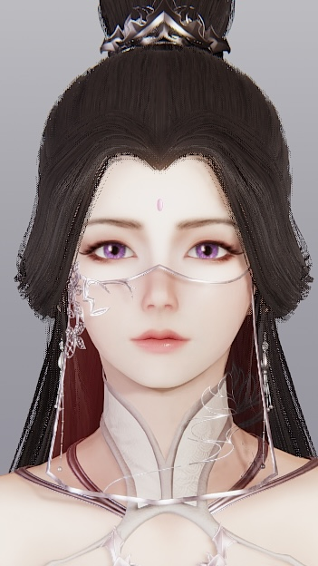
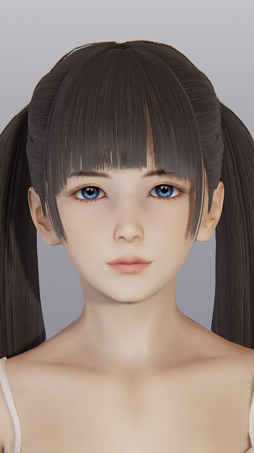

# Extract Face Data

## Introduction
- The project aims to use deep learning methods to extract facial data from images for use in Illusion's games as character card facial data.
- Currently, only AI Shoujo and Honey Select2 are supported.

## Installation
- To install this project, you need to first install the following dependencies:
	- Python 3.8+ 
	- Pytorch
	- Numpy 
	- Opencv
	- Tensorboard

- You can use the following installation command:
	- pip3 install torch torchvision torchaudio --extra-index-url https://download.pytorch.org/whl/cu116
	- pip install numpy
	- pip install opencv-python
	- pip install tensorboard
- Recommend: It is recommended to use anaconda to install in a virtual environment

## Usage

- ### Extract
	- Step 1, Using extractor.py，Create an Extractor instance
		- extractor = Extractor()
	- Step 2, Extract the face data from image to json file
		- data=extractor.extract(<image_path>,<json_path>)
	- [Optional] Step 3, Print face data to the console
		- print(data)
	- [Optional]  You can find the initConfig() function in the Extractor class to modify the configuration of the Extractor.
- ### Train
	- Step 1, Download the dataset into project root dir.
	- Step 2, Run train.py
	- [Optional]  You can find the initConfig() function in the Trainer class to modify the configuration of the Trainer.
- ### Evaluate
	- Step 1. Download the dataset into project root dir.
	- Step 2, Run evaluation.py
	- [Optional]  You can find the initConfig() function in the Evaluator class to modify the configuration of the Evaluator.

## Visualization
- Image
  

- in game
  

Face data

{
	"全脸宽度": 37,
	"脸上部前后位置": 24,
	"脸部上方和下方": 37,
	"下脸前后位置": 37,
	"脸下部宽度": 26,
	"下颚宽度": 26,
	"下巴上下位置1": 21,
	"下巴前后位置": 39,
	"下颚角度": 38,
	"下颚底部上下位置": 75,
	"下巴宽度": 25,
	"下巴上下位置2": 34,
	"下巴前后": 30,
	"脸颊下部上下位置": 52,
	"下颊前后": 29,
	"下颊宽度": 34,
	"脸颊上部上下位置": 42,
	"上颊前后": 45,
	"脸上部宽度": 39,
	"眼睛上下": 50,
	"眼位": 24,
	"眼睛前后": 17,
	"眼宽1": 38,
	"眼宽2": 36,
	"眼角z轴": 41,
	"视角y轴": 48,
	"左右眼位置1": 42,
	"左右眼位置2": 39,
	"眼角上下位置1": 57,
	"眼角上下位置2": 31,
	"眼皮形状1": 46,
	"眼皮形状2": 38,
	"整个鼻子上下位置": 36,
	"整个鼻子前后": 44,
	"鼻子整体角度X轴": 33,
	"鼻子的整个宽度": 39,
	"鼻梁高度": 25,
	"鼻梁宽度": 31,
	"鼻梁形状": 43,
	"鼻宽": 41,
	"上下鼻子": 41,
	"鼻子前后": 43,
	"机头角度X轴": 50,
	"机头角度Z轴": 35,
	"鼻子高度": 40,
	"鼻尖X轴": 43,
	"鼻尖大小": 28,
	"嘴上下": 63,
	"口宽": 34,
	"嘴唇宽度": 33,
	"嘴前后位置": 24,
	"上嘴唇形": 35,
	"下嘴唇形": 46,
	"嘴型嘴角": 39,
	"耳长": 39,
	"耳角Y轴": 48,
	"耳角Z轴": 45,
	"上耳形": 48,
	"耳下部形状": 38,
	"眉色": [
		50,
		55,
		38,
		85
	],
	"唇色": [
		151,
		69,
		78,
		57
	],
	"眼影颜色": [
		93,
		56,
		58,
		49
	],
	"腮红颜色": [
		154,
		96,
		91,
		28
	]
}

- Image
  

- in game
  

Face data

{
    "全脸宽度": 34,
    "脸上部前后位置": 22,
    "脸部上方和下方": 36,
    "下脸前后位置": 37,
    "脸下部宽度": 25,
    "下颚宽度": 25,
    "下巴上下位置1": 21,
    "下巴前后位置": 38,
    "下颚角度": 36,
    "下颚底部上下位置": 73,
    "下巴宽度": 24,
    "下巴上下位置2": 33,
    "下巴前后": 30,
    "脸颊下部上下位置": 50,
    "下颊前后": 28,
    "下颊宽度": 33,
    "脸颊上部上下位置": 40,
    "上颊前后": 45,
    "脸上部宽度": 38,
    "眼睛上下": 46,
    "眼位": 24,
    "眼睛前后": 17,
    "眼宽1": 37,
    "眼宽2": 35,
    "眼角z轴": 38,
    "视角y轴": 45,
    "左右眼位置1": 39,
    "左右眼位置2": 36,
    "眼角上下位置1": 54,
    "眼角上下位置2": 30,
    "眼皮形状1": 45,
    "眼皮形状2": 36,
    "整个鼻子上下位置": 33,
    "整个鼻子前后": 43,
    "鼻子整体角度X轴": 31,
    "鼻子的整个宽度": 38,
    "鼻梁高度": 25,
    "鼻梁宽度": 29,
    "鼻梁形状": 42,
    "鼻宽": 40,
    "上下鼻子": 39,
    "鼻子前后": 41,
    "机头角度X轴": 49,
    "机头角度Z轴": 34,
    "鼻子高度": 38,
    "鼻尖X轴": 40,
    "鼻尖大小": 27,
    "嘴上下": 60,
    "口宽": 33,
    "嘴唇宽度": 31,
    "嘴前后位置": 24,
    "上嘴唇形": 33,
    "下嘴唇形": 44,
    "嘴型嘴角": 38,
    "耳长": 37,
    "耳角Y轴": 47,
    "耳角Z轴": 44,
    "上耳形": 46,
    "耳下部形状": 37,
    "眉色": [
        46,
        52,
        34,
        81
    ],
    "唇色": [
        143,
        65,
        72,
        54
    ],
    "眼影颜色": [
        87,
        53,
        54,
        47
    ],
    "腮红颜色": [
        145,
        92,
        84,
        26
    ]
}

  